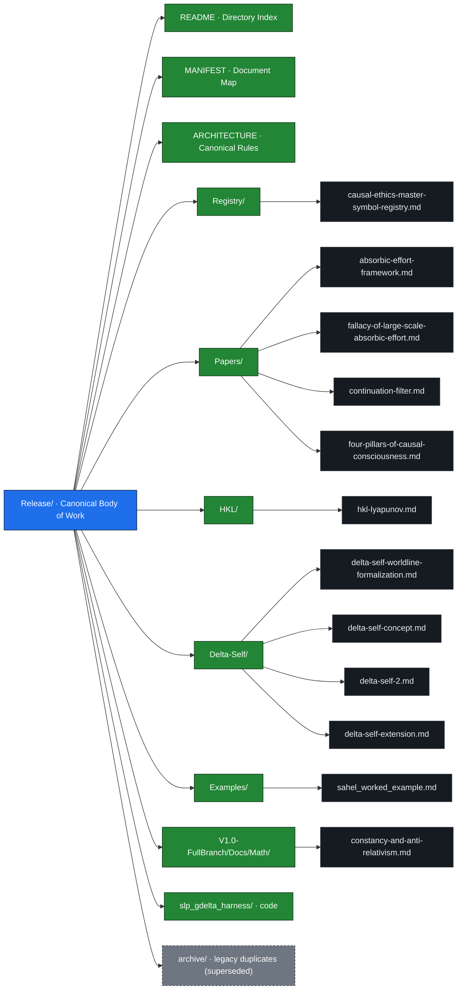

# Harmonic Knowledge Law (HKL)

The **Harmonic Knowledge Law (HKL)** repository contains the active documentation and release materials for the broader Causal Ethics / HKL / Symbolic Language Processing project suite. All work now lives on a single canonical branch (`main`); earlier working branches have been consolidated here with nothing dropped.

## Sitemap

The canonical `Release/` body of work at a glance. Prefer to click around? Open the **[interactive map](https://causal5.github.io/Harmonic-Knowledge-Law/)** — every box links to its paper. New to the framework? Read the plain-language **[Start Here](START_HERE.md)** guide. A standalone copy of this map lives in [`SITEMAP.md`](SITEMAP.md).

## Main Body of Work

The canonical main body of work is:

- [`Release/`](Release/) — the active theoretical, publication, and framework directory.

Start there. The root of the repository is only the navigation surface.

Recommended entry points:

- [`START_HERE.md`](START_HERE.md) — plain-language, six-idea on-ramp (best first read).
- [`SITEMAP.md`](SITEMAP.md) — the map above as a standalone page.
- [`Release/README.md`](Release/README.md) — primary directory index.
- [`Release/MANIFEST.md`](Release/MANIFEST.md) — canonical document map and reading order.
- [`Release/ARCHITECTURE.md`](Release/ARCHITECTURE.md) — repository architecture, canonical rules, and migration policy.
- [`Release/Registry/causal-ethics-master-symbol-registry.md`](Release/Registry/causal-ethics-master-symbol-registry.md) — master symbol registry.

## Repository Areas

### `Release/`

The active body of work: the main Causal Ethics / HKL / SLP theoretical documents, organized into canonical subdirectories.

- `Registry/` — Causal Ethics symbol and namespace registry.
- `HKL/` — Harmonic Knowledge Law stability material.
- `Delta-Self/` — Delta-Self identity and worldline documents.
- `Papers/` — Absorbic Effort, continuation-filter, and four-pillars framework papers.
- `Examples/` — worked applications of the framework.
- `V1.0-FullBranch/` — versioned mathematical documents.
- `slp_gdelta_harness/` — SLP GDelta reference harness (code).
- `archive/` — older, byte-for-byte duplicates of the organized documents, kept for historical continuity and not independently maintained.

### `Physics/`

Physics and prime-structure working material: neutrino-causality documents and torque-minima computations.

### `CorePrinciples/`

Earlier foundational and supporting documents. Valuable, but treated as supporting or legacy material unless a document is explicitly promoted into `Release/`.

Representative files:

- [`CorePrinciples/Law_of_We_Causal_Ethics.md`](CorePrinciples/Law_of_We_Causal_Ethics.md)
- [`CorePrinciples/Law_of_We_Full.md`](CorePrinciples/Law_of_We_Full.md)
- [`CorePrinciples/CausalEthicsAxis.md`](CorePrinciples/CausalEthicsAxis.md)
- [`CorePrinciples/Glossary.md`](CorePrinciples/Glossary.md)
- [`CorePrinciples/SLP_Published.md`](CorePrinciples/SLP_Published.md)

### `src/`

Implementation-oriented and experimental material for the Geometric Intelligence Learning Network / Integrated Intelligence Framework experiments.

## Project Concepts

- **Causal Ethics (CE)** — ethical alignment as a structural relationship between action, burden, consequence, and natural-system constraint.
- **Law of We** — interconnectedness and non-isolated consequence across agents and systems.
- **Harmonic Knowledge Law (HKL)** — stability and coherence framing for knowledge and intelligence systems.
- **Geometric Intelligence (GI)** — intelligence as structured navigation and deformation of a high-dimensional knowledge manifold.
- **Symbolic Language Processing (SLP)** — symbolic-indexed reasoning and reuse rather than recomputation-heavy language processing.
- **Delta-Self** — identity modeled as a trajectory or worldline rather than a static state.

## Canonical Policy

If a concept appears in multiple places, the `Release/` organized-subdirectory version is canonical unless a newer document explicitly states otherwise. Files under `Release/archive/` are preserved legacy copies and are not authoritative.

New repeated theoretical symbols should be registered in [`Release/Registry/causal-ethics-master-symbol-registry.md`](Release/Registry/causal-ethics-master-symbol-registry.md) before publication use across multiple documents.

## License

This project is licensed under the GNU Affero General Public License (AGPL) Version 3. See [`License.md`](License.md).
