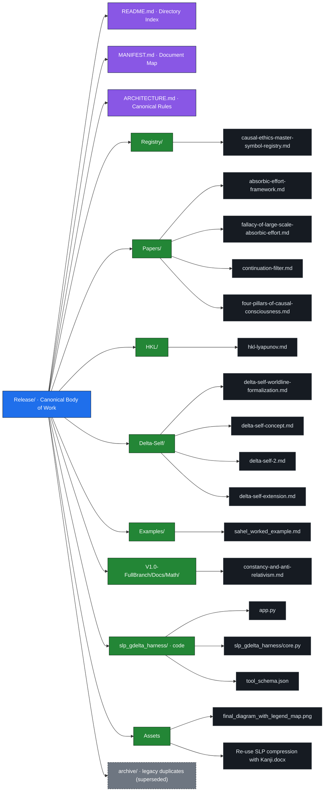

# Release Sitemap

A visual map of the canonical body of work under [`Release/`](Release/) on `main` — the material that was collected in the `repo-organization-release-index/Release` branch and has since been consolidated into the primary branch.

Each thematic subdirectory is the canonical home for its documents. The `archive/` folder holds older, byte-for-byte duplicates that have been superseded and are kept only for historical continuity.

## Legend

- **Blue** — the `Release/` root.
- **Purple** — top-level entry documents (index, manifest, architecture).
- **Green** — thematic subdirectories (canonical homes).
- **Dark** — individual documents / files.
- **Grey dashed** — `archive/` (legacy duplicates, superseded, kept for history).

