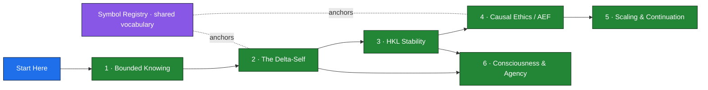

# Start Here

**A plain-language on-ramp to the Harmonic Knowledge Law / Causal Ethics / SLP framework.**

If the repository looks like forty separate documents, that is the wrong way to read it. It is really **six ideas** that build on each other, plus one shared vocabulary that keeps them consistent. This page gives you the six ideas in a sentence each and points you to where to go deeper. For the full canonical reading order, see [`Release/MANIFEST.md`](Release/MANIFEST.md).

---

## The map

Read the pillars left to right: the first two set up *who is acting and in what*, the middle two set up *what keeps a system alive and what makes action legitimate*, and the last two show *what happens at scale* and *what agency and mind look like* inside all of it. The purple registry underneath is the dictionary they all share.

---

## The six ideas

### 1. Bounded Knowing — start from what you *can't* see

Reality (the "ontic manifold") is not the same as the slice of it a system actually occupies (its **state**), and neither is the same as the lossy internal **model** an observer builds of it. No agent ever has full access to reality — only horizon-limited, incomplete observations. Every later claim inherits this humility: a model is a map, never the territory.

*Read next:* [`Registry/`](Release/Registry/causal-ethics-master-symbol-registry.md) (Namespaces I–II), and `CorePrinciples/Causal_Integrity_Axiom.md`.

### 2. The Δ-Self — identity is a path, not a state

A self is not a fixed thing you *have*; it is a **worldline** you trace — an ordered, append-only ledger of state-and-time coordinates. It is measured by how far it deviates from a "Passive Cost Baseline": what would have happened if nothing deliberately steered it. A key result is that coordinates are irreversible — you can return to the same *state* but never the same *moment*, so history always counts.

*Read next:* [`Delta-Self/delta-self-concept.md`](Release/Delta-Self/delta-self-concept.md), then [`delta-self-worldline-formalization.md`](Release/Delta-Self/delta-self-worldline-formalization.md).

### 3. HKL — stability and the viable basin

Any real system carries **burden** across many channels at once — heat, resource depletion, coordination load, ecological strain, model error. HKL aggregates these into a single Lyapunov-style burden function and asks one question: are you inside a **viable basin**, below the viability boundary, or drifting out of it? Health is staying in the basin; collapse is crossing the boundary.

*Read next:* [`HKL/hkl-lyapunov.md`](Release/HKL/hkl-lyapunov.md).

### 4. Causal Ethics & Absorbic Effort — ethics as accounting on the basin

Acting in the world injects destabilization (**Observer-Induced Entropy**, OIE); keeping the system viable takes corrective effort (the **Principle of Absorbic Effort**, PAE). The **Ethical Legitimacy Quotient** is simply the ratio of the two — are you absorbing at least as much disorder as you generate? Combined with the **Law of We** (no consequence is truly isolated), this reframes ethics as *measurable stabilization* rather than stated intention.

*Read next:* [`Papers/absorbic-effort-framework.md`](Release/Papers/absorbic-effort-framework.md), and `CorePrinciples/Law_of_We_Causal_Ethics.md`.

### 5. Scaling & Continuation — what happens at civilization scale

The **Continuation Filter** argues that any civilization that keeps amplifying its power must scale *distributed* corrective capacity just as fast — or its dependency chains destabilize and collapse. It is a structural read on Fermi's paradox: the silence may be instability, not rarity. Its companion, the **Fallacy of Large-Scale Absorbic Effort**, shows why *centralizing* that correction backfires — it displaces burden instead of absorbing it.

*Read next:* [`Papers/continuation-filter.md`](Release/Papers/continuation-filter.md), [`fallacy-of-large-scale-absorbic-effort.md`](Release/Papers/fallacy-of-large-scale-absorbic-effort.md), and the [`Examples/`](Release/Examples/sahel_worked_example.md) worked case.

### 6. Consciousness & Agency — deviation done right

The theory of mind falls out of the pieces above. **Consciousness** is control-relative deviation from the passive baseline (an agent bends its trajectory away from mere drift). **Self-awareness** is recursive self-modeling (the system simulates its own future states). And **agency stays legitimate** only when that deviation keeps the system stable. Free steering, constrained by viability.

*Read next:* [`Papers/four-pillars-of-causal-consciousness.md`](Release/Papers/four-pillars-of-causal-consciousness.md).

---

## The connective tissue: the Symbol Registry

Because these six ideas share symbols (Δ, V, PAE, and more), the [master symbol registry](Release/Registry/causal-ethics-master-symbol-registry.md) is the single source of truth for what each symbol means and where it lives. Read it once and the math across all six pillars stops looking like six different languages. Rule of thumb: **document headings carry the expressive notation; the registry keeps it honest.**

## The supporting layers

- **SLP & the harness** — Symbolic Language Processing is the representational-substrate side (how an operator stores and reuses structured knowledge); [`slp_gdelta_harness/`](Release/slp_gdelta_harness/) is the working code. The **Entourage method** covers how operators share information and capacity.
- **`Physics/`** — neutrino-causality and prime-torsion material: physical-analog explorations adjacent to the core ethics spine, not prerequisites for it.
- **`CorePrinciples/`** — the earlier foundational drafts that the `Release/` documents grew out of. Supporting, not the primary surface.

---

## Reading paths

- **10 minutes** — this page, then the [Δ-Self concept](Release/Delta-Self/delta-self-concept.md).
- **An afternoon** — pillars 1 → 4 in order: the [registry](Release/Registry/causal-ethics-master-symbol-registry.md), then [Absorbic Effort](Release/Papers/absorbic-effort-framework.md), then [HKL stability](Release/HKL/hkl-lyapunov.md), then the [Four Pillars](Release/Papers/four-pillars-of-causal-consciousness.md).
- **Full depth** — follow the canonical order in [`Release/MANIFEST.md`](Release/MANIFEST.md).

---

*This on-ramp summarizes; it does not replace the papers. The pillar descriptions are written to be edited into your own voice — adjust freely.*

